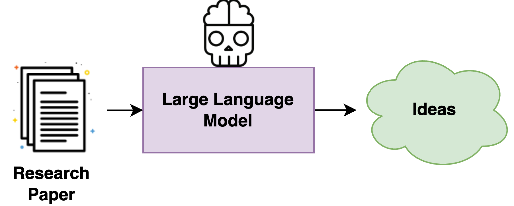

# **Future-Idea-Generation**

## **Can Large Language Models Unlock Novel Scientific Research Ideas?**

> **Description:** This repository contains the code and data used in the paper titled **"Can Large Language Models Unlock Novel Scientific Research Ideas?"**. It includes implementations for all the experiments and the data presented in the paper.

## **Table of Contents**

- [Introduction](#introduction)
- [Installation](#installation)
- [Usage](#usage)
- [Data](#data)
- [Citation](#citation)
- [Paper Image](#paper-image)
- [Contributing](#contributing)
- [License](#license)

## **Introduction**

This repository contains the official code and datasets used in our paper:

> **"Can Large Language Models Unlock Novel Scientific Research Ideas?"**

Published in **EMNLP 2024 Main**.

## Paper Link

You can read the full paper on arXiv:  
[Can Large Language Models Unlock Novel Scientific Research Ideas?](https://arxiv.org/abs/2409.06185)



"An idea is nothing more nor less than a new combination of old elements" (Young, J.W.). The widespread adoption of Large Language Models (LLMs) and publicly available ChatGPT have marked a significant turning point in the integration of Artificial Intelligence (AI) into people's everyday lives. This study explores the capability of LLMs in generating novel research ideas based on information from research papers. We conduct a thorough examination of 4 LLMs in five domains (e.g., Chemistry, Computer Science, Economics, Medical, and Physics). 

We found that the future research ideas generated by Claude-2 and GPT-4 are more aligned with the author's perspective than GPT-3.5 and Gemini 1.0. Additionally, Claude-2 generates more diverse future research ideas than GPT-4, GPT-3.5, and Gemini 1.0. We also performed a human evaluation of the novelty, relevance, and feasibility of the generated future research ideas. This investigation offers insights into the evolving role of LLMs in idea generation, highlighting both their capabilities and limitations. Our work contributes to the ongoing efforts in evaluating and utilizing language models for generating future research ideas. We make our datasets and code publicly available.

## **Installation**

1. **Clone the repository:**

    ```bash
    git clone https://github.com/sandeep82945/Future-Idea-Generation.git
    ```

2. **Install dependencies:**

    Use `pip` to install the required libraries (you may need to specify this in a `requirements.txt` file if applicable):

    ```bash
    pip install -r requirements.txt
    ```

## **Usage**

### **Data:**

- The dataset is located in the `data/` folder.
- It contains 5 domains: **Computer Science, Physics, Chemistry, Economics,** and **Medical**.
- The dataset includes papers with future inspirations in the `Final/` folder.
- The extracted future inspirations are stored in the `annotations/RealF/` folder in Excel sheet format.

### **Run the experiments:**

1. **To calculate the IAScore:**

    ```bash
    python code/run2.py
    ```

2. **To use LLM as a judge:**

    ```bash
    python code/GPT_as_reviewer.py
    ```

## **Citation**

If you use this code or data in your research, please cite our paper:

```bibtex
@article{kumar2024can,
  title={Can Large Language Models Unlock Novel Scientific Research Ideas?},
  author={Kumar, Sandeep and Ghosal, Tirthankar and Goyal, Vinayak and Ekbal, Asif},
  journal={arXiv preprint arXiv:2409.06185},
  year={2024}
}
